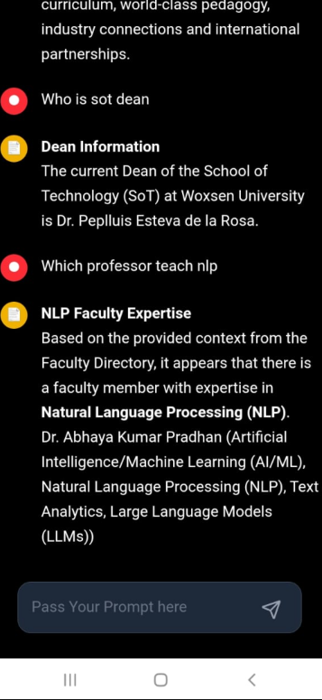

# 🏫 University Chatbot – RAG-based Question Answering System

A powerful **Retrieval-Augmented Generation (RAG)** based chatbot that answers questions related to **university programs, admissions, deadlines, and campus information**.

Built with:

- **LangChain** + **Ollama** for LLM orchestration
- **Vector DBs** for semantic context retrieval
- **vLLM** for scalable, concurrent inference
- **React + Node.js** for a full-stack web interface

---

## ✳️ Key Features

- ❯ Context-aware question answering using RAG
- ❯ Fast semantic search with vector embeddings
- ❯ Clean and scalable architecture (React + Node.js + Python)
- ❯ Optimized for performance with caching and `vLLM`
- ❯ Fully offline/local inference with `Ollama` support

---

## 🧠 System Architecture

```text
  ┌────────────┐
  │  Frontend  │ ◄──────────── User Interface (React)
  └─────┬──────┘
        │
        ▼
  ┌────────────┐
  │ Node.js API│ ◄──────────── Frontend sends user queries
  └─────┬──────┘
        │
        ▼
  ┌────────────────────────────┐
  │ Python Backend (LangChain) │ ◄──── Embeds query & retrieves context
  └─────┬──────────────────────┘
        │
        ▼
  ┌───────────────┐
  │ Vector DB     │ ◄──── Semantic search (FAISS / Chroma)
  └───────────────┘
        │
        ▼
  ┌──────────────┐
  │ LLM (vLLM /  │ ◄──── Prompt + context goes to the model
  │ Ollama)      │
  └──────────────┘
        │
        ▼
  ◄─────┐ Returns final answer
  ┌────────────┐
  │  Frontend  │
  └────────────┘




